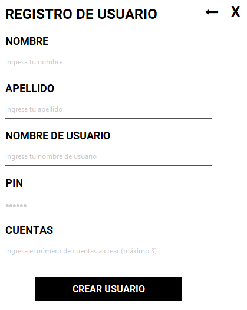
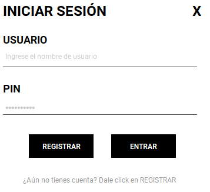
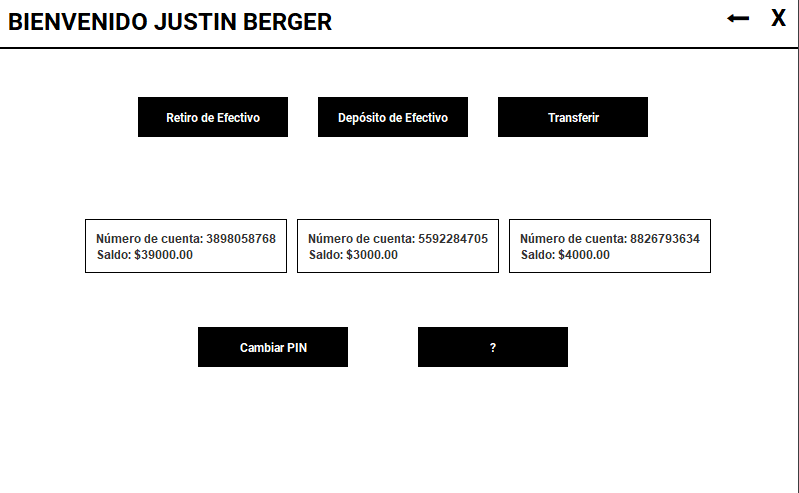

# ATM Management System College Project
**Duration:** June 2023 - August 2023

## Project Description
Developed an ATM Management System as a college project that aimed to simulate a functional Automated Teller Machine (ATM) using Java and MySQL. The project successfully achieved all outlined requirements, demonstrating proficiency in Java programming and database management.

## Key Achievements
- Designed and implemented a user-friendly interface using the Java Swing library to provide a seamless user experience.
- Implemented a secure user authentication system that required users to input their Personal Identification Number (PIN) for access.
- Enabled balance inquiry, cash withdrawal, and cash deposit functionalities, ensuring accurate balance updates after each transaction.
- Developed fund transfer capabilities for both intra-account and inter-account transfers within the bank.
- Implemented a PIN change feature to enhance account security.
- Incorporated receipt printing options to provide users with transaction details after each successful transaction.
- Ensured data security by implementing encryption for sensitive user information and robust error handling.
- Established transaction logging to record and store user transactions for future reference and auditing purposes.

## Technologies Used
Java, MySQL, Java Swing Library, NetBeans, DBeaver

## Achieved Requirements
1. **User Authentication:** Implemented a secure PIN-based authentication system.
2. **Balance Inquiry:** Enabled users to check their account balances.
3. **Cash Withdrawal:** Developed a system for users to withdraw cash securely.
4. **Cash Deposit:** Implemented accurate cash deposit functionality.
5. **Fund Transfers:** Created options for transferring funds between accounts.
6. **PIN Change:** Enabled users to change their PIN for enhanced security.
7. **Receipt Printing:** Provided users with transaction receipts.
8. **Security Measures:** Implemented data encryption, protection against unauthorized access, and effective error management.
9. **Intuitive UI:** Designed a user-friendly interface with clear instructions and navigation.
10. **Transaction Logging:** Established a system to log and store user transactions for reference and audits.

## Screenshots

